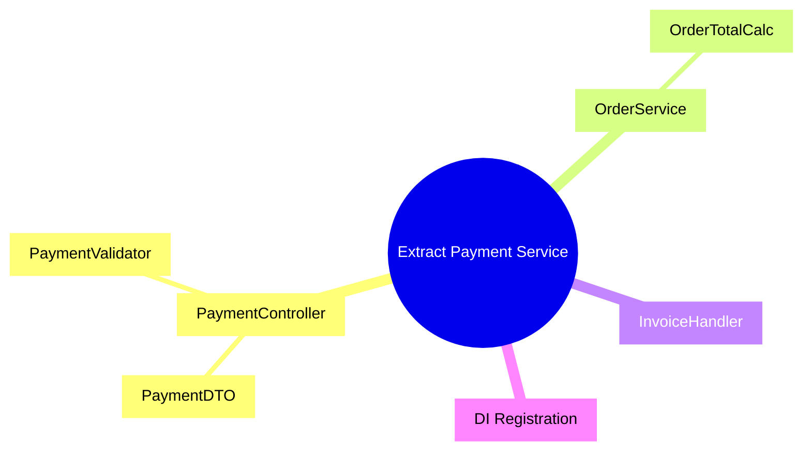

# Mikado Agent

An [Agent Skill](https://agentskills.io) that automates the **Mikado Method** for large-scale code refactoring. It discovers the full dependency graph of breaking changes by recursively attempting changes in isolated git worktrees, recording what breaks, and building a complete Mikado mindmap with a leaf-first resolution order.

> The Mikado Method is from the book *[The Mikado Method](https://www.manning.com/books/the-mikado-method)* by Ola Ellnestam & Daniel Brolund.

## What It Does

The agent **explores** — it does not fix code. It produces a documented Mikado Graph showing every break, its cause, and how to fix it. You apply the fixes afterwards, leaf-first, in small safe commits.



## Installation

```bash
npx skills add droosma/mikadoagent
```

Or install globally for all projects:

```bash
npx skills add droosma/mikadoagent --global
```

Works with **40+ agents** including GitHub Copilot, Claude Code, OpenCode, Cursor, Windsurf, and more via the [Agent Skills spec](https://agentskills.io).

## When to Use

- Extracting a service, interface, or module from a monolith
- Replacing a framework, library, or architectural pattern
- Renaming types used across many files and projects
- Any change where "just doing it" produces cascading breaks

## When NOT to Use

- Simple, localized refactorings (rename a variable, extract a method)
- Greenfield development

## How It Works

1. **Attempt** the desired change naively in an isolated git worktree
2. **Observe** what breaks (compiler errors, test failures, analyzer warnings)
3. **Cluster** errors by root cause into logical breaks
4. **Record** each break as a node with context, errors, and a proposed fix
5. **Revert** by discarding the worktree (the graph holds the knowledge)
6. **Recurse** into each break — fan out in parallel, each in its own worktree
7. **Terminate** when all branches reach leaves (no breaks) or cycles

The output is a session directory with a Mermaid mindmap and individual node files:

```
doc/refactor/20260310-001-extract-payment-service/
├── session.md              # Session metadata and progress
├── mikado-graph.md         # Mermaid mindmap + resolution order
└── nodes/
    ├── 0-extract-payment-service.md
    ├── 1-payment-controller.md
    ├── 1.1-payment-dto.md
    └── ...
```

## Language Support

Currently supported: **C#** (via `languages/csharp.md`).

Adding a new language is straightforward — copy `languages/_template.md`, fill in build/test/analysis commands and error patterns.

## Project Structure

```
├── SKILL.md                          # Main orchestrator (Agent Skills entry point)
├── mikado-method-reference.md        # Mikado Method reference (loaded into context)
├── skills/
│   ├── 01-assess-refactor.md         # Phase 1: Interview & feasibility
│   ├── 02-initialize-session.md      # Phase 2: Session setup, baseline verification
│   ├── 03-attempt-change.md          # Phase 3: Naive attempt in worktree
│   ├── 03b-analyze-breaks.md         # Phase 3b: Cluster errors into logical breaks
│   ├── 03c-cross-solution-scan.md    # Phase 3c: Multi-solution impact check
│   ├── 04-report-to-orchestrator.md  # Phase 4: Sub-agent → orchestrator handoff
│   ├── 05-fan-out.md                 # Phase 5: Parallel sub-agent spawning
│   ├── 05b-generation-report.md      # Phase 5b: Generation status updates
│   └── 06-finalize-graph.md          # Phase 6: Final graph + cleanup
├── languages/
│   ├── csharp.md                     # C# language profile
│   └── _template.md                  # Template for new languages
├── examples/
│   └── sample-session/               # Complete worked example
├── evals/
│   └── evals.json                    # Test prompts for validation
└── LICENSE
```

## Safety Limits

The agent has built-in limits to prevent runaway exploration:

| Limit | Default | Purpose |
|-------|---------|---------|
| Max nodes | 50 | Prevents unbounded graph growth |
| Max depth | 8 | Catches potential circular design issues |
| Max generations | 6 | Bounds total exploration time |
| Error volume abort | 500+ | Signals the change is too large to attempt naively |

All defaults are overridable in `session.md`.

## Contributing

Contributions welcome! Areas that would be especially useful:

- **Language profiles** — TypeScript, Java, Python, Go (copy `languages/_template.md`)
- **Fix execution phase** — Sequential leaf-first fix application (Phase 7)
- **More examples** — Real-world session outputs from different refactoring scenarios

## License

[MIT](LICENSE)

## Acknowledgments

Based on the Mikado Method by Ola Ellnestam and Daniel Brolund. The method reference in this skill is a distillation of their work for use by LLM agents.
