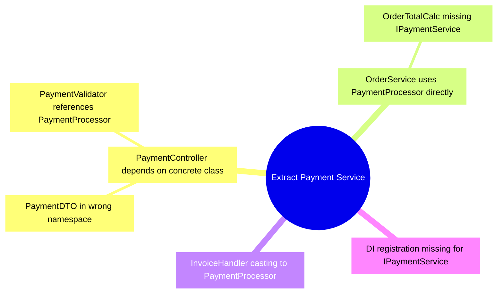

# Mikado Graph — Extract Payment Service

## Legend

- **Root (double circle):** The target refactor goal
- **Branch (square):** A break that caused further breaks
- **Leaf (square, no children):** A break that can be fixed directly

## Resolution Order

Apply fixes leaf-first, bottom-up:

1. **1.1** — Move `PaymentDTO` to `Payment.Contracts` namespace
2. **1.2** — Change `PaymentValidator` to accept `IPaymentService`
3. **2.1** — Update `OrderTotalCalc` to use `IPaymentService`
4. **3** — Replace `PaymentProcessor` cast in `InvoiceHandler` with interface call
5. **4** — Add `IPaymentService`/`PaymentService` DI registration in `Program.cs`
6. **1** — Update `PaymentController` constructor to accept `IPaymentService`
7. **2** — Update `OrderService` to use `IPaymentService`
8. **0** — Extract Payment Service (root goal achieved)

## Quick Reference

For each step, see the corresponding node file in `nodes/` for full details.
